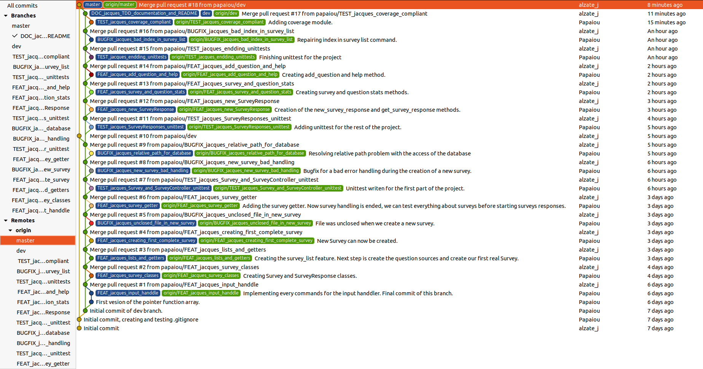

# GitFlow documentation

During this project, I used a well-known GitFlow process. Unfortunately, usual hotfix and release branches were useless during the development of the project. Indeed, only master, develop and featuring branches were created.

## GitFlow process

If we want to apply our GitFlow process, we need to start from master branch and create our develop (dev) branch. From our dev branch we will create all our feature branches. Feature branches will be named like this : 

`<FEAT|DOC|TEST|BUGFIX>_<developper_name>_<subject_of_the_feature>`

Once enough features are merged on the dev branch, we can merge dev to master.

With this configuration, each member of the team can work on its branch and nobody will break anything on a branch of another member of the team.