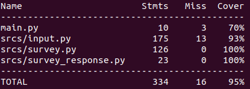

# Code coverage documentation

In this section we will talk about result obtained on the code coverage tf this project. But before about this, we need to see how does it work.

## Requirements

If you want to see how does our code coverage work, you first need to install, via pip3, a module named `coverage`

```bash
sudo apt-get install python3 && sudo apt-get install python3-setuptools && sudo apt-get install python3-pip && pip install coverage
```
This is the only requirement we need to run our program and our coverage.

## Usage

```bash
echo `cat unittest/entire_test.txt` | coverage run main.py && coverage report
```

This command allow you to run the project with all unittest at the same time. You will see the output of the program followed by our coverage report :



In this report, we can see that at least 95% of the project is covered by our tests.

## entire_test.txt

This file represents all the unit test of Surveyy_unittest.py and Add_question_unittest.py. All those entries are run in a unique command separated by ```\n```.